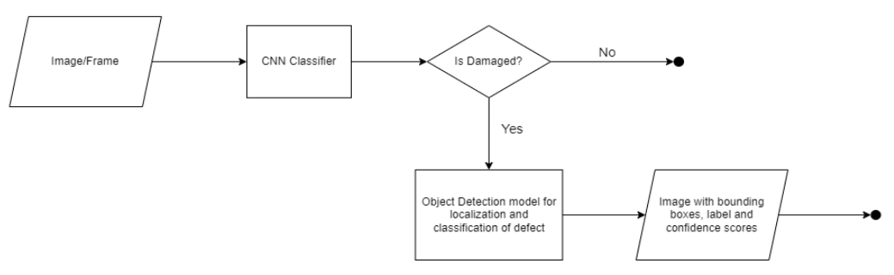
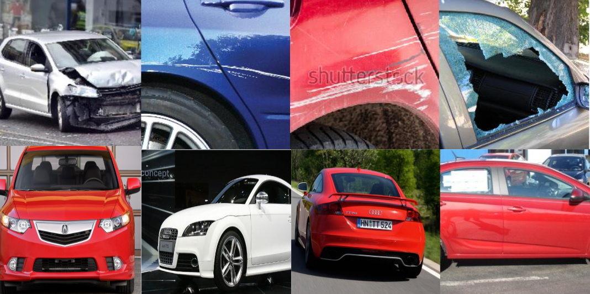
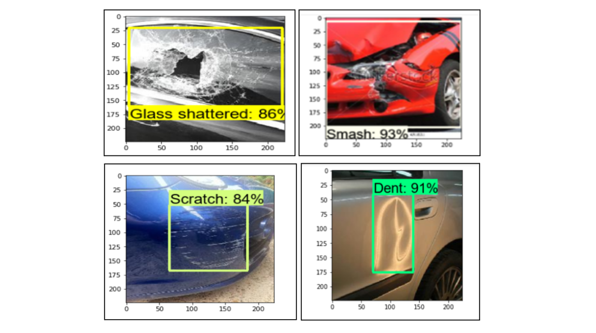

# Two-fold Car Damage Detection Model using CNN and Object Detection 

Car damage detection systems play a vital role in scenarios, like the insurance claims process, accident reporting systems, or a documented write-up of the various damages a vehicle in a car garage evinces upon entry and exit. 

This project presents a two-fold model architecture for damage detection ensuring high accuracy and efficiency streamlining vehicle inspection processes while minimizing human error. The model is designed to support use cases in the insurance industry, automotive repair, and accident reporting systems, providing a scalable solution for automated damage assessment.


## Architecture 



This system features a two-fold model architecture:

1. **Classification Layer (CNN)**:
    - The first stage uses a CNN-based model to classify input images as either clear (undamaged) or damaged. This helps filter out undamaged vehicles, focusing only on those that require detailed analysis.

2. **Object Detection Layer**:
    - After the classification step, damaged images are passed onto an object detection model. This layer detects and localizes different types of damage, such as:
        - Scratches
        - Dents
        - Glass Shattered
        - Smash

This two-step process ensures both efficient filtering and accurate localization, enabling precise damage detection and classification.

## Dataset 



The model has been trained on a diverse set of vehicle images that include both undamaged and damaged vehicles. The damage types in the dataset cover a range of common vehicle issues, such as scratches, dents, glass shattered, and smashed areas. 

- **Dataset Size:** Approx 3000 images segregated accordingly to train the 2 models separately 
- **Data Source:** Mix of kaggle datasets and bulk download from Google Images 
- **Annotation Tool:** Annotations were performed using the LabelImg tool

## Results 



## Installation 

1. Clone the repository and change directory

    ```bash
    git clone https://github.com/SaniaE/car-damage-detection.git
    cd path/to/repo/clone
    ```
2. Create and activate a new virtual enviornment

    ```bash
    python -m venv <environment_name>
    .\<environment_name>\Scripts\activate   # For Windows
    source <environment_name>/bin/activate  # For macOS/Linux
    ```
3. Add virtual environment to the Python Kernel 

    ```bash
    python -m pip install --upgrade pip 
    pip install ipykernel 
    python -m ipykernel install --user --name=<kernel_name>
    ```
4. Install dependencies

    ```bash
    pip install -r requirements.txt
    ```
5. Launch Jupyter Notebook 

    ```bash
    jupyter notebook
    ``` 
    
6. About the notebooks:
    - `Car Damage Classification (CNN).ipynb` trains a CNN model for car damage classification, covering data loading, visualization, model architecture, training, and tracking accuracy and loss trends.
    - `CNN Filter Test.ipynb` loads the saved CNN checkpoint and runs inference on a directory of images to classify them as clear or damaged.
    - `Image Annotation Setup.ipynb` guides through setting up the annotation environment, covering annotation tool configuration, and launches the tool to annotate images required for object detection
    - `Object Detection Training.ipynb` details the process of training the object detection model. It includes steps for data loading, creating TFRecords and label maps, downloading a pretrained model, setting up the configuration, and running the training process using the appropriate commands. 
    - `Object Detection Inferences.ipynb` outlines the steps for loading the trained model, performing inference, and evaluating the model's performance on unseen data.